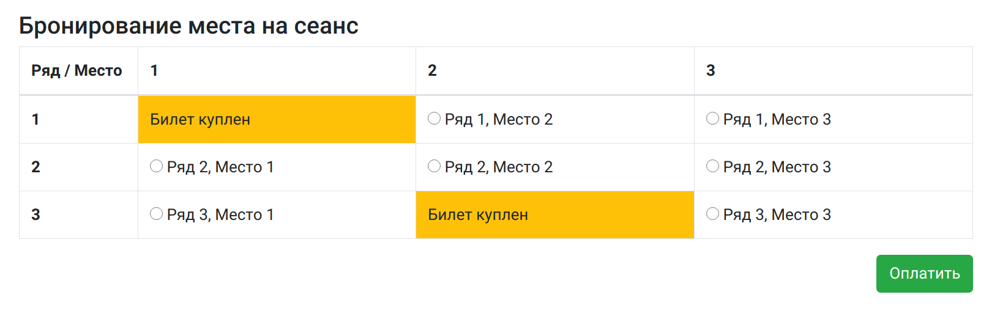
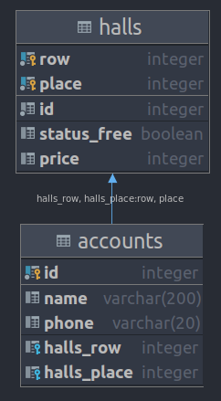

# Проект - Cinema

## Описание
Сервис позволяет покупать билеты в кинотеатр. Основан на асинхронных сервлетах и ajax.
Позволяет видеть какие места свободны, а какие заняты без обновления страницы.
Цена билета зависит от места.

## Технологии
* Java 14
* Java Servlets
* PostgreSQL
* JDBC
* Apache TomCat
* JSP/JSTL
* Library GSON
* Javascript, AJAX, HTML, Bootstrap
* Maven

## Функциональность
#### Страница выбора места

#### Страница оплаты

#### Схема базы данных

#### Контакты

&nbsp;
&nbsp;
&nbsp;